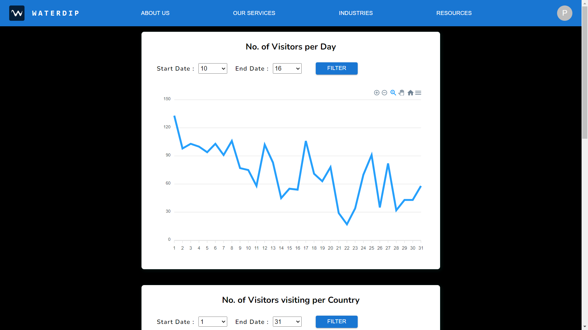

# Waterdip AI Frontend Assignment

This assignment involves creating a dashboard using the hotel booking data given.

> The data can be stored as a file or can be put into any db and create a simple API to pull data for the UI.

## Task

- Create a dashboard with date filter and 4 charts
  - Timeseries chart
  - Column chart
  - 2 Sparkline charts
- Implement using React + Typescript
- Use Git for version control

<details><summary>Final Image</summary>

---



</details>

## How to run

```bash
# Clone the repo using this command
$ git clone https://github.com/Rushijaviya/WaterdipAI.git

# navigate to this directory
$ cd WaterdipAI

# Install all dependencies and sub-dependencies using this command
$ npm install

# To start the development server
$ npm run dev

# To watching the live preview, go to
$ http://localhost:5173

```
